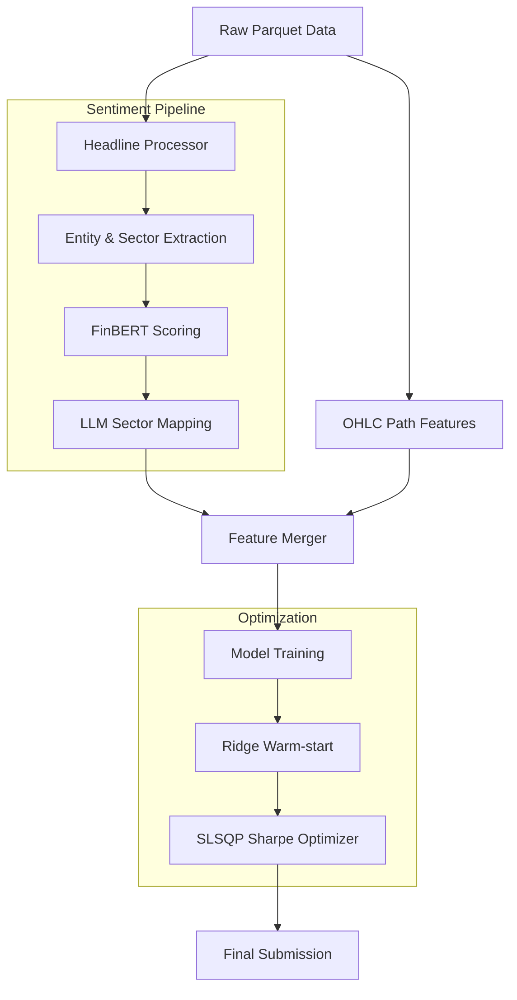

# Datathon HRT 06-2026: Financial Sentiment & Sharpe Optimization Pipeline

This repository contains a high-performance trading signal pipeline designed for the simulated market price prediction challenge. It combines traditional price-action features with granular financial sentiment analysis, optimized using a custom regularized Sharpe ratio objective.

## 🚀 Quick Start

### Prerequisites
- **Python:** `3.13.5`
- **Environment Manager:** [`uv`](https://astral.sh/uv) (strongly recommended)

### Installation & Setup
```bash
# Clone the repository
git clone <repo-url>
cd datathon-HRT-06-2026

# Sync environment and dependencies
uv sync
```

### Reproduce Final Results
> [!IMPORTANT]
> **Data Dependency:** You must generate the processed sentiment and sector files (see [Auxiliary Data Generation](#-auxiliary-data-generation)) **before** running the prediction script below.

To generate the final submission CSV using our best-performing method:
```bash
PYTHONPATH=src uv run python -m datathon_sharpe.cli \
    --data-dir data \
    --method sharpe_augmented \
    --augment-test-proxy \
    -o Submissions/submission_sharpe_final.csv
```

---

## 🛠 Pipeline Architecture

The pipeline follows a multi-stage process: from raw market data and headlines to granular sentiment extraction, feature engineering, and finally, Sharpe-optimized position sizing.



---

## Modeling Methods

> [!TIP]
> **Exploration First:** It is highly recommended to use the [Data Visualization & Exploration](#-data-visualization--exploration) tools to understand session-level dynamics and feature-label correlations *before* fitting complex models. This ensures your feature selection is grounded in empirical data.

### 1. Sharpe-Linear Ensemble (Main)
The primary strategy uses linear models for their robustness in high-noise environments.
- **Sharpe Augmented:** Anchors weights to a stable Ridge model to prevent overfitting.
- **Objective:** $J(\beta) = -\text{Sharpe}((X\beta) \cdot R) + \lambda \cdot \text{MSE}(X\beta, w_{ridge})$.

### 2. Gaussian HMM Regime Detection
We use a **Hidden Markov Model (HMM)** from `hmmlearn` to identify latent market regimes (e.g., trending vs. mean-reverting).
- **Featurization:** The HMM acts as a structural prior, generating posterior probabilities for each state.
- **Linear Head:** A regularized linear head is fit on top of these HMM states to determine the optimal position for each regime.

<details>
<summary><b>Method: Ridge Regression</b></summary>

**Financial Intuition:** Minimizes Mean Squared Error with L2 penalty. 
- **Use Case:** Provides a stable baseline by assuming a linear relationship between features and the next-period return $R$.
</details>

<details>
<summary><b>Method: Distributional Monotonicity</b></summary>

**Financial Intuition:** Focuses on the probability of the sign of the move rather than the magnitude.
- **Policy:** Uses `prob_sign` or `quantile_median` to determine position direction based on the distribution of expected outcomes.
</details>

---

## 🎭 LLM & Sentiment Integration

### 1. Local Sentiment (FinBERT & Hugging Face)
We utilize **Hugging Face's `transformers`** library to run `ProsusAI/finbert` locally.
- **Acceleration:** Optimized for **Apple Silicon (MPS)** and **CUDA**.
- **Scoring:** Generates a continuous score ($P_{pos} - P_{neg}$) between -1.0 and 1.0.

### 2. LLM Orchestration (Gemini & Ollama)
For complex tasks like entity extraction and sector mapping, we support both cloud and local LLMs.
- **Google Gemini:** Primary choice for high-accuracy batch processing. Requires `GEMINI_API_KEY` in `.env`.
- **Ollama:** Supported for 100% local inference (e.g., `llama3`). Configurable via `OLLAMA_HOST`.

---

## 📊 Feature Engineering Logic

### 1. Price-Action (Path) Features
We extract 19+ session-level features from the OHLC (Open, High, Low, Close) bars:
- **Momentum:** Cumulative returns, last 5-bar returns, log-close slope.
- **Volatility:** Realized volatility (std of returns), Parkinson variance, volatility regime splits (first vs. second half).
- **Risk:** Max drawdown within the session, skewness of bar returns, p95 extreme moves.
- **Trend Stability:** $R^2$ of the log-price regression.

### 2. Headline Sentiment Incorporation
Headlines are processed to extract granular signals that are often missed by broad price movements:
- **Entity Identification:** Always identifies the primary company mentioned (word 0).
- **Sentiment Scoring:** Uses `ProsusAI/finbert` to generate continuous scores (-1.0 to 1.0).
- **Sector Mapping:** Granular sectors (e.g., "Renewables") are mapped to 5 canonical categories (`Healthcare`, `Finance`, `Technology`, `Consumer Goods`, `Energy`) using LLMs (Gemini/Ollama) to ensure cross-session consistency.
- **Aggregated Features:**
    - `sentiment_ret_corr`: Correlation between bar returns and headline sentiment.
    - `sector_entropy`: Diversity of sectors mentioned within a session.
    - `sentiment_weighted_mean`: Sentiment weighted by model confidence.

---

## 🔄 Headline Processing Sequence

To generate the final processed sentiment files, the pipeline follows this strict sequence:

1. **Initialization:** The `get_or_process_file` entry point in `src/headline_processor` is called.
2. **Local Scoring:** Headlines are passed to `FinBertPredictor` for fast, local sentiment scoring.
3. **LLM Analysis:** Batches are sent to the LLM (Gemini/Ollama) to identify the **Company** and provide **Reasoning**.
4. **Sector Mapping:** Unique granular sectors are collected and mapped to canonical broad sectors in a single LLM pass to ensure consistency.
5. **Caching:** Results are saved as `{filename}_processed_{model}.parquet` in the `data/` directory to prevent redundant API calls.

Run the full processing script:
```bash
uv run python scripts/process_sentiment.py \
    --input data/headlines_seen_train.parquet \
    --provider finbert \
    --batch-size 128
```

---

## 📝 Configuration (.env)
Create a `.env` file in the root directory:
```env
# Gemini API (Optional for cloud)
GEMINI_API_KEY=your_key_here

# Ollama (Optional for local LLM)
OLLAMA_HOST=http://localhost:11434
OLLAMA_MODEL=llama3
```

---

## 📝 Auxiliary Data Generation

If you need to re-process raw headlines or update sector mappings:

1. **Process Raw Sentiment:**
   ```bash
   uv run python scripts/process_sentiment.py --input data/headlines_seen_train.parquet --batch-size 128
   ```
2. **Update Sector Mappings (LLM required):**
   ```bash
   uv run python scripts/update_sectors.py --files data/sentiments_*.csv --provider gemini
   ```

---

## 🏁 Final Notes

## 📊 Data Visualization & Exploration

We provide an interactive dashboard to explore the relationship between market OHLC data, headlines, and future returns.

### 1. Interactive Dashboard (Streamlit)
The dashboard allows you to visualize individual sessions, inspect candlestick charts with overlaid news events, and analyze cross-correlations between "seen" features and "unseen" labels.

**To run the dashboard:**
```bash
uv run streamlit run Data_Dashboard/app.py
```

**Key Features:**
- **Session Explorer:** View interactive candlestick charts for any session ID. Headlines are marked with orange diamonds; hovering reveals the text.
- **Dataset Overview:** Analyze the distribution of returns and headline counts across Train, Public Test, and Private Test sets.
- **Correlation Matrix:** (Train only) Explore which technical features (volatility, momentum, range) have the highest linear or monotonic correlation with the target return $R$.

### 2. Manual Data Exploration
For quick command-line inspection of the raw Parquet files:
- **`scripts/parquet_to_readable_text.py`**: Converts binary Parquet data into human-readable text for quick grepping.
- **`research/explore_headlines.ipynb`**: A Jupyter notebook for deep-diving into the headline distributions and sector frequencies.

---

## 🏁 Final Notes
- **Hardware Acceleration:** The pipeline is optimized for MPS (Apple Silicon) using `torch`.
- **Scaling:** Features are `StandardScaled` inside the optimizer to ensure uniform gradient descent.
- **Scale Invariance:** Since the Sharpe ratio is scale-invariant, the final weights are normalized to ensure a consistent risk profile across submissions.
